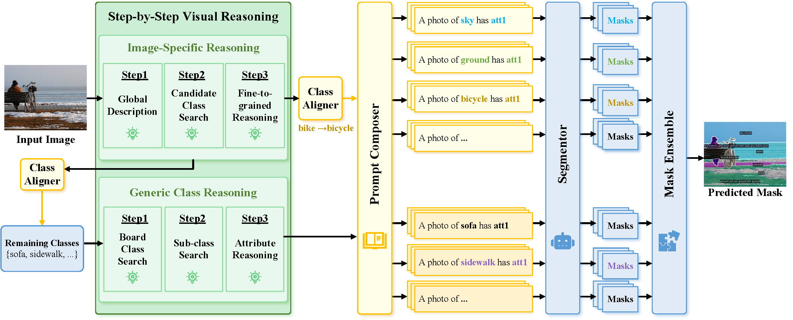

# 

<div align="center">
<h1> OpenSeg-R </h1>
<h3>Improving Open-Vocabulary
Segmentation via Step-by-Step Visual Reasoning</h3>


[Zongyan Han](https://github.com/Hanzy1996)<sup>1</sup>,[Jiale Cao](https://jialecao001.github.io)<sup>2</sup>,[Shuo Chen](https://shuochenya.github.io)<sup>3</sup>, [Tong Wang](https://wangtong627.github.io)<sup>1</sup>, [Jorma Laaksonen](https://www.aalto.fi/en/people/jorma-laaksonen)<sup>4</sup>, [Rao Muhammad Anwer](https://scholar.google.fi/citations?user=_KlvMVoAAAAJ&hl=en)<sup>1</sup>,

<sup>1</sup> Mohamed Bin Zayed University of Artificial Intelligence (MBZUAI), <sup>2</sup> Tianjin University, <sup>3</sup> Nanjing University, <sup>4</sup> Aalto University

</div>

## Introduction
Open-Vocabulary Segmentation (OVS) has drawn increasing attention for its capacity to generalize segmentation beyond predefined categories. However, existing methods typically predict segmentation masks with simple forward inference, lacking explicit reasoning and interpretability.  This makes it challenging for OVS model to distinguish similar categories in open-world settings due to the lack of contextual understanding and discriminative visual cues. To address this limitation, we propose a step-by-step visual reasoning framework for open-vocabulary segmentation, named **OpenSeg-R**. The proposed OpenSeg-R leverages Large Multimodal Models (LMMs) to perform hierarchical visual reasoning before segmentation.  Specifically, we generate both generic and image-specific reasoning for each image, forming structured triplets that explain the visual reason for objects in a coarse-to-fine manner. Based on these reasoning steps, we can compose detailed description prompts, and feed them to the segmentor to produce more accurate segmentation masks. To the best of our knowledge, OpenSeg-R is the first framework to introduce explicit step-by-step visual reasoning into OVS. Experimental results demonstrate that OpenSeg-R significantly outperforms state-of-the-art methods on open-vocabulary semantic segmentation across five benchmark datasets. Moreover, it achieves consistent gains across all metrics on open-vocabulary panoptic segmentation. Qualitative results further highlight the effectiveness of our reasoning-guided framework in improving both segmentation precision and interpretability.




## Experiment
We utilize both [MAFT+](https://github.com/jiaosiyu1999/MAFT-Plus) and [SED](https://github.com/xb534/SED) as open-vocabulary segmentation for our framework.
Here we provide the instructions for reproducing our results with MAFT+. We will release the code for SED in the future.
For ```OpenSeg-R w MAFT+```, we follow all setting in [MAFT+](https://github.com/jiaosiyu1999/MAFT-Plus) as below:
### Installation
1. Clone the repository
    ```
    git clone https://github.com/Hanzy1996/OpenSeg-R.git
    ```
2. Navigate to the project directory
    ```
    cd OpenSeg-R
    ```
3. Install the dependencies
    ```
    bash install.sh
    cd maft/modeling/pixel_decoder/ops
    sh make.sh
    ```

<span id="2"></span>

### Data Preparation
First, generate the image-specific reasons and generic class reasoning using [Qwen2.5-VL-72B-Instruct-AWQ](https://huggingface.co/Qwen/Qwen2.5-VL-72B-Instruct-AWQ), and save them in ```./reason_data/image_reason``` and ```./reason_data/generic_reason``` respectively. 
We also recommend extracting the text features of the image-specific reasons in advance for faster evaluation. These features could be saved in ```./reason_data/image_reason_feat```.  
Here we provide the reasoning results for PC59, and we will release the reasoning results for other datasets, along with the reasoning processing code, in the future.

Then, refer to [MAFT+](https://github.com/jiaosiyu1999/MAFT-Plus) for dataset preparation and organization.  

The data structure is similar to that of MAFT, with some modifications to accommodate the new dataset format and reasoning method.

```
reason_data/
  general_reason/
  image_reason/
    ade150/
    ade846/
    pc59/
    pc459/
    voc20/
  image_reason_feat
    ade150/
      Convnext-B/
      Convnext-L/
    ...
datasets/
  ade/
      ADEChallengeData2016/
        images/
        annotations_detectron2/
      ADE20K_2021_17_01/
        images/
        annotations_detectron2/
  coco/
        train2017/
        val2017/
        stuffthingmaps_detectron2/
  VOCdevkit/
     VOC2012/
        images_detectron2/
        annotations_ovs/      
    VOC2010/
        images/
        annotations_detectron2_ovs/
            pc59_val/
            pc459_val/      
```
<span id="3"></span>

- #### Evaluation
  <span id="4"></span>
  First, download the pre-trained model from [MAFT+](https://github.com/jiaosiyu1999/MAFT-Plus) and saved them into ```./pretrained```.
  Then, evaluate ```OpenSeg-R with MAFT+``` using the following command on validation sets of other datasets.
  ```
  sh eval_reason_base.sh
  sh eval_reason_large.sh
  sh eval_reason_pano.sh
  ```
<span id="5"></span>
### Cite 

If this codebase is useful to you, please consider citing:
```
```
### Acknowledgement
[MAFT+](https://github.com/jiaosiyu1999/MAFT-Plus)

[SED](https://github.com/xb534/SED)